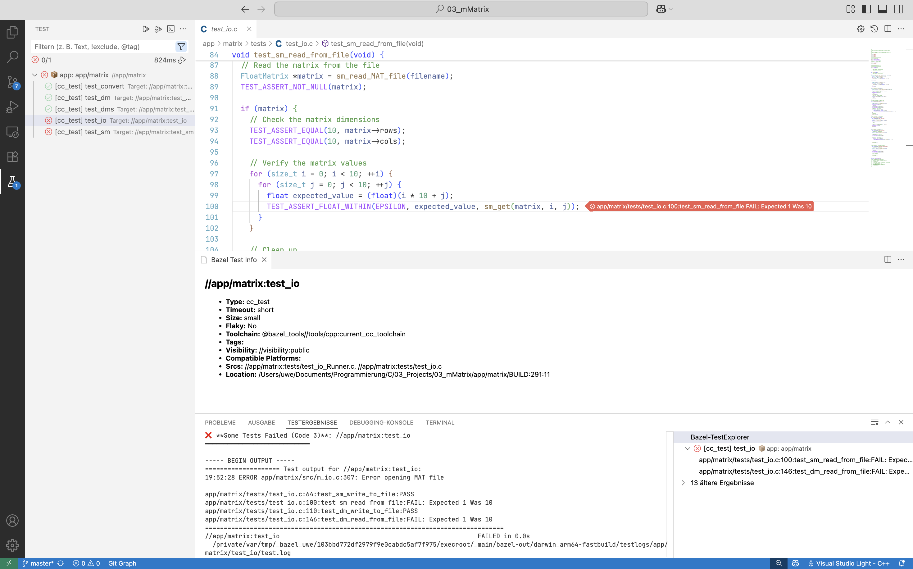

# Bazel TestExplorer - VS Code Extension

A VS Code extension for managing Bazel-based tests, including **cc_test**.

It uses 'bazel query' to identify test-cases and 'bazel test' to perform them.

## Features
- **View tests** - in Test Explorer.
- **View test report** - in Test Results.
- **ShowMetadata** - show test-target attributes.
- **Filter for test tags** -  i.e. @smoke [tag]("https://bazel.build/reference/be/common-definitions#common.tags").
- **Customizable Test Types** – Configure additional test types like 'java_test', 'py_test', 'rust_test', ... .
- **New: Support of test_suites** - Collect all your tests in [test_suites](https://bazel.build/reference/be/general#test_suite) like "relase".
- **Bazel Test args** - Add test args to Bazel, i.e. --config=linux, ... .
- **Gutter Markers (Beta)** - Multiple failure locations supported.
- **Query Paths** - Optional set for relative Bazel paths (i.e. //tests) where tests should be queried (useful in Repos with submodules).
- **New: Bazel Test Encyclopedia Conformance** - Automatic per-target flag handling (exclusive, external tags).
- **New: Two-Phase Discovery** - Optional performance optimization for large workspaces (10,000+ tests).
- **New: Metadata Display** - Show test size, timeout, flaky status, and tags in test tree.
- **New: Lazy test_suite Expansion** - Expand test_suite items to show contained tests on-demand.

## Screenshot

## Installation
1. Install the extension from the VS Code Marketplace.
2. Ensure Bazel is installed.

## Usage
1. Open the **Test Explorer** (`View` → `Testing`).
2. Run tests by clicking the play button next to a test.

## Configuration

### Basic Settings
- `bazelTestExplorer.testTypes`: List of Bazel test types to detect (default: `["cc_test"]`)
- `bazelTestExplorer.queryPaths`: Relative Bazel paths where tests should be queried (default: `[]` = entire workspace)
- `bazelTestExplorer.testArgs`: Additional command line arguments to pass to `bazel test`
- `bazelTestExplorer.maxParallelQueries`: Maximum concurrent Bazel queries during discovery (default: 4)

### Performance Features

#### Two-Phase Discovery (Experimental)
Enable faster test discovery in large monorepos:
- `bazelTestExplorer.discovery.twoPhase`: Enable two-phase discovery (default: `false`)
- `bazelTestExplorer.discovery.metadataChunkSize`: Chunk size for metadata queries (default: `500`, min: `50`, max: `2000`)

When enabled, discovery runs in two phases:
1. **Phase 1**: Fast label-only query (`--output=label`)
2. **Phase 2**: Chunked metadata query for specific labels (parallel, configurable chunk size)

This can significantly improve performance in large workspaces (10,000+ tests) by reducing the amount of data transferred in the initial query.

#### Metadata Display
- `bazelTestExplorer.showMetadataInLabel`: Display test metadata in labels/tooltips (default: `false`)

Shows: `size`, `timeout`, `tags`, `flaky` status directly in the test tree. Example: `size=small timeout=short tags=exclusive,external flaky`

### Bazel Test Encyclopedia Conformance

The extension now fully conforms to the [Bazel Test Encyclopedia](https://bazel.build/reference/test-encyclopedia):

#### Per-Target Flags
Automatically applies flags based on target tags:
- **`exclusive` tag** → `--test_strategy=exclusive` (serializes test execution)
- **`external` tag** → `--cache_test_results=no` (disables caching for non-hermetic tests)

These flags are applied automatically based on target metadata, no manual configuration needed.

#### Flaky Detection
- Visible flaky indicator (⚠️) in test tree for tests marked with `flaky = True`
- Bazel's native flaky handling via `--runs_per_test` and `--runs_per_test_detects_flakes`

#### Lazy test_suite Expansion
- `test_suite` items can be expanded to show contained tests
- Expansion is lazy (on-demand) to avoid slowing down initial discovery
- Uses `bazel query "tests(<suite>)" --output=label`

#### Centralized Log Resolution
- Uses `bazel info bazel-testlogs` as single source of truth for test log location
- Cached for 1 minute to avoid repeated calls
- Graceful fallback to standard location if query fails

## Roadmap
- **Code Coverage Integration**.
- **Debugging Support**.

## Tested with
- cc_test: boost.test, catch2, criterion, doctest, gtest, munit, ThrowTheSwitch, unittest_cpp
- py_test: doctest, pytest, unittest
- rust_test: build-in
- java_test: JUnit
- go_test: build-in

## License
MIT License

