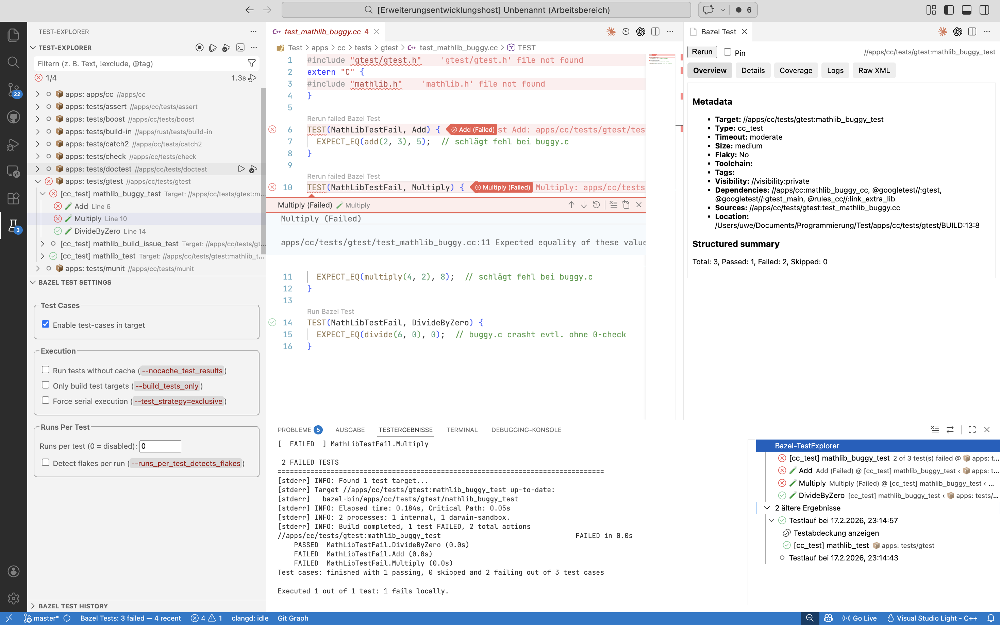

# Bazel TestExplorer

Test Explorer + Coverage for Bazel tests in VS Code.

Uses `bazel query`, `bazel test`, and `bazel coverage`, integrated with the VS Code Testing API.

## Features
- Show tests in the Testing view (query + run).
- CodeLens, gutter markers, diagnostics.
- Coverage reports in the Testing UI.
- Test Details panel (incl. Coverage tab).
- Advanced Bazel test settings.

## Installation
1. Install the extension from the VS Code Marketplace.
2. Ensure Bazel is installed.

## Usage
1. Open **Testing**.
2. Run tests or Coverage from the UI.

## Settings
- `bazelTestExplorer.testTypes` - e.g. `cc_test`, `rust_test`, `py_test`, `go_test`.
- `bazelTestExplorer.queryPaths` - `//...` or specific paths.
- `bazelTestExplorer.testArgs` - extra flags for `bazel test`.
- `bazelTestExplorer.coverageArgs` - extra flags for `bazel coverage`.

## Screenshot

## Remarks to coverage:
To get a working coverage (with C/C++) is sometimes annoying.
Here some tipps:
- MODULE.bazel.: 
  - use `bazel_dep(name = "toolchains_llvm", version = "1.6.0")` and `llvm_version = "19.1.0"` or newer.
- .bazelrc: 
  - `--combined_report=lcov` creates a central `bazel-out/_coverage/_coverage_report.dat` for easier coverage aggregation.
  -  `--instrumentation_filter=.*` can be slow in large repositories. Adjust this filter in settings to match your source paths (e.g. `--instrumentation_filter="//src/..."`).
  -  set `coverage --experimental_use_llvm_covmap` and `coverage --experimental_generate_llvm_lcov`
  - on macOS set `coverage --copt=-fcoverage-compilation-dir=.`
- System:
  - `c++filt` / `rustfilt` should be available in `PATH` for demangled names in coverage.

Coverage should be working in terminal!! If not the extension can not fix this.

## License
MIT License
