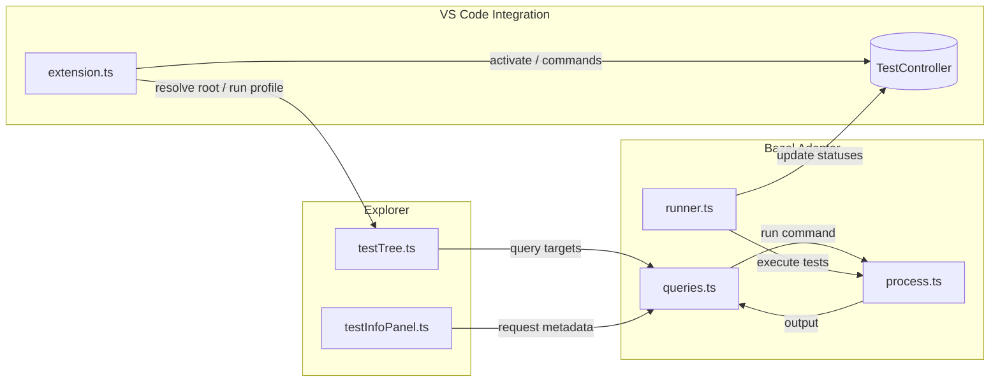

```mermaid
flowchart LR
  %% Simplified overview: VS Code, Explorer, Bazel Adapter
  subgraph VSCode[VS Code Integration]
    EXT[extension.ts]
    TC[(TestController)]
  end

  subgraph Explorer[Explorer]
    TREENODE[testTree.ts]
    INFO[testInfoPanel.ts]
  end

  subgraph Bazel[Bazel Adapter]
    QUERIES[queries.ts]
    RUNNER[runner.ts]
    PROCESS[process.ts]
  end

  EXT -->|activate / commands| TC
  EXT -->|resolve root / run profile| TREENODE
  TREENODE -->|query targets| QUERIES
  QUERIES -->|run command| PROCESS
  PROCESS -->|output| QUERIES
  RUNNER -->|execute tests| PROCESS
  RUNNER -->|update statuses| TC
  INFO -->|request metadata| QUERIES

  %% Note: Details (parsing, discovery, logging, patterns, failures) bewusst reduziert
```