# Bazel TestExplorer - Software Architecture

## Table of Contents
1. [Overview](#overview)
2. [High-Level Architecture](#high-level-architecture)
3. [Layered Architecture](#layered-architecture)
4. [Detailed Component Architecture](#detailed-component-architecture)
5. [Data Flow and Interactions](#data-flow-and-interactions)
6. [Key Design Patterns](#key-design-patterns)

---

## Overview

**Bazel TestExplorer** is a VS Code extension that integrates Bazel-based tests into the VS Code Testing UI. It enables developers to discover, run, debug, and analyze tests directly from the editor.

### Core Functionalities

- **Test Discovery**: Automatically finds test targets using `bazel query`
- **Test Execution**: Runs tests via `bazel test` with real-time feedback
- **Test Management**: Organizes tests in a hierarchical tree view
- **Result Analysis**: Parses test output, extracts failures, and provides navigation to error locations
- **Test History**: Tracks test executions and provides historical data
- **Metadata Display**: Shows test attributes, tags, and configuration

---

## High-Level Architecture

```mermaid
graph TB
    subgraph "User Interaction"
        USER[👤 Developer]
        VSCODE_UI[VS Code Test Explorer UI]
    end
    
    subgraph "Bazel TestExplorer Extension"
        EXTENSION[Extension Core]
    end
    
    subgraph "External Systems"
        BAZEL[🔧 Bazel Build System]
        WORKSPACE[📁 Workspace/BUILD Files]
    end
    
    USER -->|Clicks Run/Debug| VSCODE_UI
    VSCODE_UI <-->|Test API| EXTENSION
    EXTENSION -->|bazel query| BAZEL
    EXTENSION -->|bazel test| BAZEL
    BAZEL -->|Reads| WORKSPACE
    EXTENSION -->|Parses| WORKSPACE
    
    style USER fill:#e3f2fd
    style EXTENSION fill:#fff3e0
    style BAZEL fill:#c8e6c9
    style WORKSPACE fill:#f3e5f5
```



### Basic Flow

1. **Activation**: Extension detects Bazel workspace (MODULE.bazel or WORKSPACE file)
2. **Discovery**: Queries Bazel for test targets matching configured test types
3. **Display**: Builds hierarchical test tree in VS Code Test Explorer
4. **Execution**: Runs selected tests via Bazel and streams output
5. **Analysis**: Parses results, extracts failures, updates UI with pass/fail status
6. **Navigation**: Provides links to failure locations in source code

---

## Layered Architecture

The extension follows a **layered architecture** with clear separation of concerns:


### Layer Responsibilities

#### Layer 1: Presentation Layer
**Purpose**: User interface and user interaction
- **Components**: Test Explorer integration, command handlers, info panels
- **Responsibilities**: 
  - Display test tree in VS Code UI
  - Handle user commands (run, debug, reload)
  - Show test metadata and history
  - Provide status feedback

#### Layer 2: Application Layer
**Purpose**: Application logic and workflow orchestration
- **Components**: Test Controller Manager, Test Observer, Event Bus
- **Responsibilities**:
  - Orchestrate test discovery and execution workflows
  - Manage test lifecycle (created → running → passed/failed)
  - Coordinate between UI and domain layer
  - Handle file watching and auto-reload

#### Layer 3: Domain Layer
**Purpose**: Core business logic
- **Components**: Test Discovery, Test Runner, Output Parsers
- **Responsibilities**:
  - Discover tests from Bazel workspace
  - Execute test runs
  - Parse test output and extract results
  - Apply test filtering strategies
  - Identify test case granularity

#### Layer 4: Integration Layer
**Purpose**: External system integration
- **Components**: Bazel Client, Process Manager, Workspace Handler
- **Responsibilities**:
  - Provide unified interface to Bazel CLI
  - Manage process execution and output streaming
  - Handle Bazel workspace detection
  - Abstract Bazel-specific operations

#### Layer 5: Infrastructure Layer
**Purpose**: Cross-cutting concerns and utilities
- **Components**: Configuration Service, Logger, Cache, Error Handler
- **Responsibilities**:
  - Manage extension settings
  - Provide centralized logging
  - Cache query results for performance
  - Handle errors consistently

---

## Detailed Component Architecture

```mermaid
graph TB
    subgraph "VS Code Extension Host"
        EXT[Extension Entry Point<br/>extension.ts]
        
        subgraph "Presentation Layer"
            CTRL[TestControllerManager<br/>• Manages VS Code TestController<br/>• Registers commands<br/>• Creates run profiles]
            TREE[TestTree<br/>• Builds test hierarchy<br/>• Updates test items<br/>• Resolves test children]
            PANEL[TestInfoPanel<br/>• Shows test metadata<br/>• Displays attributes/tags<br/>• Query test details]
            HIST[TestHistoryProvider<br/>• Tracks execution history<br/>• TreeView provider<br/>• Rerun from history]
        end
        
        subgraph "Application Layer"
            OBS[TestObserver<br/>• Monitors test lifecycle<br/>• Records runtimes<br/>• Emits test events]
            BUS[TestEventBus<br/>• Event-driven communication<br/>• Publishes test start/finish<br/>• Decouples components]
        end
        
        subgraph "Domain Layer"
            DISC[TestDiscovery<br/>• Query test targets<br/>• Filter by tags/types<br/>• Cache results<br/>• Discover test cases]
            RUNNER[TestRunner<br/>• Execute bazel test<br/>• Stream output<br/>• Handle cancellation<br/>• Sequential/parallel runs]
            PARSE[OutputParser<br/>• Parse test results<br/>• Extract failures<br/>• Match patterns<br/>• Map to source locations]
        end
        
        subgraph "Integration Layer"
            CLIENT[BazelClient<br/>• Facade for Bazel ops<br/>• Query tests<br/>• Run tests<br/>• Get metadata<br/>• Validate installation]
            QUERY[QueryBuilder<br/>• Build bazel query<br/>• Target resolution<br/>• Label expansion]
            PROC[ProcessManager<br/>• Execute shell commands<br/>• Stream output<br/>• Handle timeouts]
            WS[WorkspaceHandler<br/>• Detect Bazel workspace<br/>• Find MODULE.bazel/WORKSPACE<br/>• Resolve paths]
        end
        
        subgraph "Infrastructure Layer"
            CONFIG[ConfigurationService<br/>• Read settings<br/>• testTypes<br/>• queryPaths<br/>• testArgs]
            LOG[Logger<br/>• Centralized logging<br/>• Timestamps<br/>• Performance metrics]
            CACHE[QueryCache<br/>• Cache test queries<br/>• TTL management<br/>• Invalidation]
            ERR[ErrorHandler<br/>• Centralized error handling<br/>• User notifications<br/>• Error recovery]
        end
    end
    
    subgraph "External Systems"
        VSCODE[VS Code API<br/>Testing API<br/>Commands<br/>UI Components]
        BAZEL[Bazel CLI<br/>query<br/>test<br/>cquery]
        FS[File System<br/>BUILD files<br/>Source files<br/>Test outputs]
    end
    
    %% Connections
    EXT --> CTRL
    EXT --> CONFIG
    EXT --> LOG
    
    CTRL --> TREE
    CTRL --> OBS
    CTRL --> BUS
    CTRL --> DISC
    CTRL --> RUNNER
    
    TREE --> DISC
    TREE --> CLIENT
    
    PANEL --> CLIENT
    
    HIST --> BUS
    
    OBS --> BUS
    OBS --> RUNNER
    
    DISC --> CLIENT
    DISC --> CACHE
    
    RUNNER --> CLIENT
    RUNNER --> PARSE
    
    CLIENT --> QUERY
    CLIENT --> PROC
    CLIENT --> WS
    CLIENT --> CACHE
    CLIENT --> ERR
    
    PROC --> BAZEL
    WS --> FS
    
    %% External connections
    CTRL <--> VSCODE
    TREE <--> VSCODE
    HIST <--> VSCODE
    PANEL <--> VSCODE
    
    ERR --> LOG
    CONFIG --> VSCODE
    
    style EXT fill:#01579b,color:#fff
    style VSCODE fill:#c62828,color:#fff
    style BAZEL fill:#2e7d32,color:#fff
    style FS fill:#6a1b9a,color:#fff
```



### Component Details

#### Extension Entry Point (`extension.ts`)
**Lifecycle Hook**: Activated when Bazel workspace detected

**Responsibilities**:
- Initialize logger and services
- Detect Bazel workspace
- Validate Bazel installation
- Create BazelClient and ConfigurationService
- Initialize TestControllerManager
- Register TestObserver and TestHistoryProvider

**Key Dependencies**: All major services

---

#### TestControllerManager
**Purpose**: Orchestrates all test-related operations in VS Code

**Responsibilities**:
- Create and manage VS Code TestController
- Register command handlers (`reloadBazelTests`, `showTestMetadata`, etc.)
- Create run profiles (Run, Debug, Coverage)
- Set up file watchers for BUILD files
- Handle configuration changes
- Trigger test discovery and execution

**Key Methods**:
- `initialize()`: Set up commands, profiles, watchers
- `handleTestRun()`: Process test execution requests
- `reloadTests()`: Trigger test rediscovery

---

#### TestTree
**Purpose**: Build and maintain test hierarchy

**Responsibilities**:
- Query tests via discovery service
- Build hierarchical structure (workspace → packages → targets → test cases)
- Create VS Code TestItems
- Handle lazy loading of test cases
- Update test tree on file changes

**Structure**:
```
Workspace Root
└── //package/path
    ├── target_name (cc_test, py_test, etc.)
    │   ├── test_case_1
    │   ├── test_case_2
    │   └── test_case_3
    └── another_target
```

---

#### TestDiscovery
**Purpose**: Discover test targets from Bazel

**Responsibilities**:
- Build and execute Bazel queries
- Filter tests by types and tags
- Apply query paths configuration
- Cache discovery results
- Support test_suite expansion
- Discover individual test cases (experimental)

**Query Examples**:
```
bazel query 'kind("cc_test", //...)'
bazel query 'attr("tags", "smoke", //...)'
bazel query 'tests(//path/to:test_suite)'
```

---

#### TestRunner
**Purpose**: Execute Bazel tests

**Responsibilities**:
- Run `bazel test` with configured arguments
- Stream output to VS Code TestRun
- Parse output for results
- Handle sequential vs parallel execution
- Support cancellation
- Extract failure information

**Execution Modes**:
- **Parallel**: Default for most test types
- **Sequential**: Configurable per test type (e.g., java_test)

---

#### BazelClient
**Purpose**: Unified facade for Bazel operations

**Responsibilities**:
- Abstract Bazel CLI interactions
- Provide caching layer
- Handle errors consistently
- Validate Bazel installation
- Query tests, metadata, and attributes
- Execute test runs

**Key Methods**:
- `validate()`: Check Bazel availability and version
- `queryTests()`: Get all test targets
- `queryTestMetadata()`: Get test attributes
- `runTests()`: Execute tests
- `getTestCaseList()`: Discover test cases

---

#### OutputParser
**Purpose**: Parse Bazel test output

**Responsibilities**:
- Parse test results from Bazel output
- Extract pass/fail status
- Find failure messages
- Extract file paths and line numbers
- Match against framework-specific patterns
- Create VS Code TestMessage objects

**Supported Frameworks**:
- **C++**: gtest, catch2, boost.test, doctest, munit, criterion
- **Python**: unittest, pytest, doctest
- **Java**: JUnit
- **Rust**: Built-in test framework
- **Go**: Built-in test framework

**Pattern Matching**:
```regex
^(.+?):(\d+): Failure          # gtest
^(.+?):(\d+): FAILED           # catch2
File "(.+?)", line (\d+)       # Python unittest
```

---

#### ProcessManager
**Purpose**: Execute shell commands safely

**Responsibilities**:
- Spawn child processes
- Stream stdout/stderr
- Handle process termination
- Support cancellation
- Timeout handling
- Error propagation

---

#### QueryCache
**Purpose**: Cache Bazel query results

**Responsibilities**:
- Cache test discovery results
- TTL-based invalidation
- Key generation from config
- Memory management

**Configuration**:
- `testCaseDiscoveryCacheMs`: Configurable TTL (default: 15s)

---

#### ConfigurationService
**Purpose**: Manage extension settings

**Key Settings**:
- `testTypes`: Test rule types to discover (default: `["cc_test"]`)
- `queryPaths`: Paths to query (default: `["//..."]`)
- `testArgs`: Additional bazel test arguments
- `sequentialTestTypes`: Test types to run sequentially
- `failLinePatterns`: Regex for failure extraction
- `enableTestCaseDiscovery`: Enable granular test discovery

---

#### ErrorHandler
**Purpose**: Centralized error handling

**Responsibilities**:
- Catch and classify errors
- Show user-friendly messages
- Log error details
- Suggest recovery actions
- Handle Bazel-specific errors

---

## Data Flow and Interactions

### 1. Extension Activation Flow


### 2. Test Discovery Flow


### 3. Test Execution Flow


### 4. Test Metadata Display Flow

```mermaid
sequenceDiagram
    participant User
    participant VSCode
    participant InfoPanel
    participant BazelClient
    participant Bazel
    
    User->>VSCode: Right-click test → Show Metadata
    VSCode->>InfoPanel: showTestMetadata(testId)
    InfoPanel->>BazelClient: queryTestMetadata(target)
    BazelClient->>Bazel: bazel query --output=xml //target
    Bazel-->>BazelClient: XML with attributes
    BazelClient-->>InfoPanel: Metadata object
    InfoPanel->>VSCode: showTextDocument()
    VSCode-->>User: Display metadata panel
```



### 5. File Change Detection Flow


---

## Key Design Patterns

### 1. Facade Pattern
**Where**: `BazelClient`

**Purpose**: Provide unified interface to complex Bazel subsystem

**Benefits**:
- Simplifies Bazel interactions
- Centralizes caching and error handling
- Abstracts process management

### 2. Observer Pattern
**Where**: `TestObserver`, `TestEventBus`

**Purpose**: Event-driven communication between components

**Benefits**:
- Loose coupling
- Easy to add new listeners
- Centralized event handling

### 3. Strategy Pattern
**Where**: `TestFilterStrategies`

**Purpose**: Different filtering strategies for tests (by tag, type, path)

**Benefits**:
- Pluggable filtering logic
- Easy to add new strategies
- Clean separation of concerns

### 4. Cache Pattern
**Where**: `QueryCache`

**Purpose**: Avoid redundant Bazel queries

**Benefits**:
- Performance improvement
- Reduced Bazel overhead
- Configurable TTL

### 5. Builder Pattern
**Where**: `QueryBuilder`

**Purpose**: Construct complex Bazel queries

**Benefits**:
- Fluent API
- Easy to compose queries
- Type-safe query construction

### 6. Command Pattern
**Where**: Command registration in `TestControllerManager`

**Purpose**: Encapsulate operations as commands

**Benefits**:
- Easy to add new commands
- Centralized command handling
- Support for undo/redo (future)

---

## Configuration and Extensibility

### Extension Settings

```json
{
  "bazelTestExplorer.testTypes": ["cc_test", "py_test", "java_test"],
  "bazelTestExplorer.queryPaths": ["//tests", "//integration"],
  "bazelTestExplorer.testArgs": ["--config=ci", "--runs_per_test=2"],
  "bazelTestExplorer.sequentialTestTypes": ["java_test"],
  "bazelTestExplorer.failLinePatterns": [
    "^(.+?):(\\d+): Failure",
    "File \"(.+?)\", line (\\d+)"
  ],
  "bazelTestExplorer.enableTestCaseDiscovery": true,
  "bazelTestExplorer.testCaseDiscoveryCacheMs": 15000
}
```

### Adding New Test Framework Support

To add support for a new test framework:

1. **Add test type** to `testTypes` configuration
2. **Add failure pattern** to `testPatterns.ts`
3. **Update parser** in `parseFailures.ts` if needed
4. **Configure execution mode** (sequential/parallel)

**Example: Adding Robot Framework**:
```typescript
// In testPatterns.ts
export const ROBOT_PATTERNS = [
  /^(.+?):(\d+): FAIL (.+)$/
];

// In parseFailures.ts
if (testType === 'robot_test') {
  patterns.push(...ROBOT_PATTERNS);
}
```

---

## Performance Considerations

### Query Caching
- Default TTL: 15 seconds
- Configurable via `testCaseDiscoveryCacheMs`
- Invalidated on configuration change

### Test Case Discovery
- Optional feature (disabled by default)
- Requires running tests with `--list` flag
- Cached per test target
- Overhead: ~1-2 seconds per target

### Parallel Execution
- Default execution mode
- Can run multiple test targets simultaneously
- Exception: `sequentialTestTypes` (e.g., Java tests with shared state)

### File Watching
- Debounced with 2-second delay
- Only watches BUILD, BUILD.bazel files
- Triggers incremental reload

---

## Error Handling Strategy

### Error Categories

1. **Bazel Not Found**: Show setup instructions
2. **Invalid Workspace**: Suggest checking MODULE.bazel/WORKSPACE
3. **Query Failures**: Log details, show user-friendly message
4. **Test Execution Failures**: Parse and display in Test Results
5. **Parse Errors**: Graceful degradation, log for debugging

### Error Recovery

- **Retry logic**: For transient Bazel errors
- **Graceful degradation**: Show partial results if available
- **User guidance**: Suggest configuration fixes
- **Logging**: Detailed logs for troubleshooting

---

## Future Enhancements

### Planned Features
- **Code Coverage Integration**: Display coverage in editor
- **Debugging Support**: Attach debugger to test process
- **Test Parametrization**: Support for parameterized tests
- **Remote Execution**: Support for remote Bazel execution
- **Test Impact Analysis**: Run only affected tests

### Architecture Improvements
- **Language Server Protocol**: For better test discovery
- **Incremental Updates**: Smarter cache invalidation
- **WebView UI**: Rich test result visualization
- **Test Snapshots**: Save and compare test results over time

---

## Summary

The Bazel TestExplorer follows a **clean, layered architecture** with clear separation of concerns:

- **Presentation Layer**: User interface integration
- **Application Layer**: Workflow orchestration
- **Domain Layer**: Core business logic
- **Integration Layer**: External system abstraction
- **Infrastructure Layer**: Cross-cutting concerns

This design enables:
- **Maintainability**: Clear responsibilities per component
- **Testability**: Isolated, mockable components
- **Extensibility**: Easy to add new features
- **Performance**: Caching and optimized queries
- **Reliability**: Robust error handling

The extension seamlessly integrates Bazel's powerful build system with VS Code's intuitive testing UI, providing developers with a productive test management experience.
